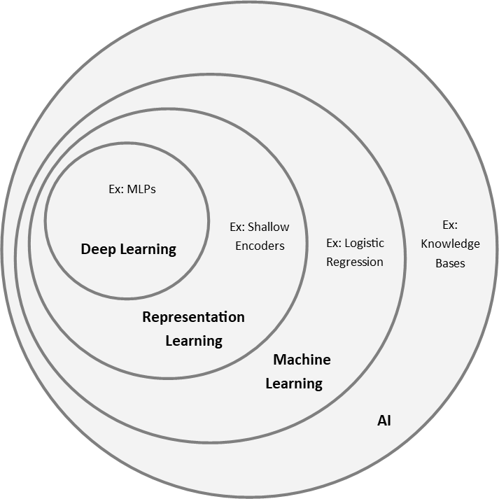

```{r setup, include=FALSE}
knitr::opts_chunk$set(echo=TRUE)
```


# Introdcution

Gathering knowledge through experience, without the need for humans to explicitly program instructions, and create a hierchy of complicated concepts allows the compute to develop a deep graph of knowledge with many layers is currently called **deep learning** in AI.

AI projects that have historically attempted to hard-code knowledge about the world in formal languages, allowing a computer to use logical inference rules, is referred to as the **knowledge base** approach to AI.

Allowing a computer to extract aptterns from raw data is **machine learning**, which enable computers to solve problems involving knowledge of the real world and make decisions that appear subjective.

The performance of machine learning algorithms depends heavily on the **representation** of the available data. In other words, the features provided to describe a problem need to be relevant in order to draw conclusions on unseen observations.

One approach to discover the mapping from representation to the output and also the representation itself is known as **representation learning**.

The quentisential example of representation learning is the **autoencoder**; a combination of an **encoder** function, which convert the input data into a different representation, and a decoder function, which converts the new representation back into the original format.

When designing features or algorithms for learning features, we aim to separate **factors of variation** that explain the observed data. *Factors* refer to the separate sources of influence. For example, when analyzing an image of a car, the factors of variation include the position of thwe car, its color, and that angle/brightness of the sun.

A major challenge in AI is the *disentaglment* of the factors of variation; only keeping the relevant ones.

**Deep learning** solves the problem of representation learning by introducing representations that are expressed in terms of other, simpler representations.

A basic example of the deep learning model is the feedforward deep netork, or **multilayer perceptron (MLP)**. These models offer a sequential execution of instructions that can help later sets of instructions through the execution process.

There are two ways to measure the depth of a model:

1) The number of sequential instructions that must be executed to evaluate the architecture (i.e. the longest path through a flow chart that explains how to compute each output given its inputs).
2) Another approach, used by deep probablistic models, does not measure depth by the structure of the computational graph, but the depth of the graph describing how concepts are related to each other.

> In summary, **Deep Learning** is a type of machine learning that achieves power and flexibility by representating the world as a series of nested hierarchy of concepts, with each concept defined in relation to simpler concepts, and more abstract representations computed in terms of less abstract ones.




<!-- 
 -->

# Linear Algebra
